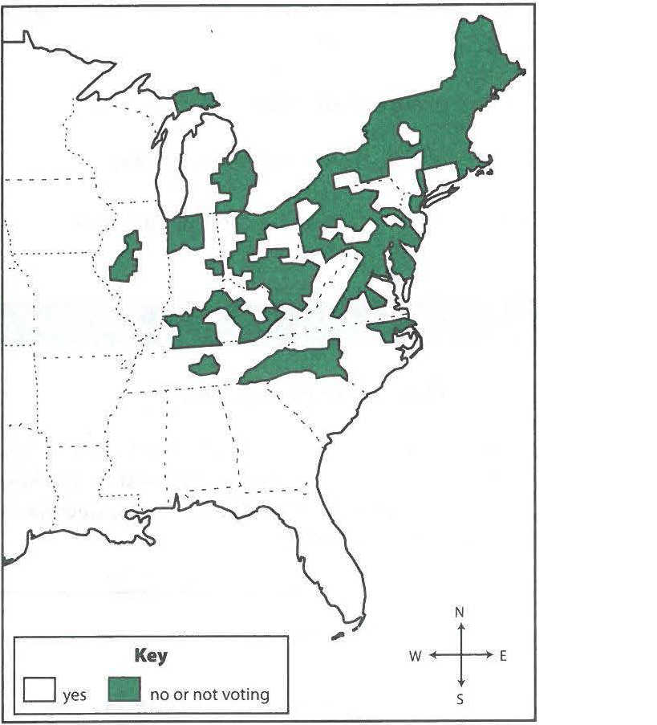

---
title: Skill Practice

source:
- title: Common Core Basics
  subject: Social Studies
  chapter: 2
  toc_type: Lesson Review
  toc_number: 2.1
  pages: 78 - 85

questions:
  - excerpt: 1, 2
    text: >
      Sectionalism and the Vote in Congress on Texas Annexation, 1845
      
  - number: 1
    text: >
      According to the map. in which region did most states vote no on the question of annexing  Texas?
    choice:
      - option: A
        text: South
      - option: B
        text: West
      - option: C
        text: Northeast
      - option: D
        text: Southwest
    answer:
      - option: C
        text: Most of the states that voted against annexing Texas were in the Northeast.
  - number: 2
    text: >
      Which conclusion about the voting pattern does the map support?
    choice:
      - option: A
        text: The Northern states were opposed to adding another Southern state in the Union.
      - option: B
        text: The Northern states supported Mexico's right to Texas.
      - option: C
        text: The Southern states preferred that Texas stay independent.
      - option: D
        text: The Northern states feared Texas's industrial competition.
    answer:
      - option: A
        text: >
          The Northern states did not want another Southern state in the Union.
  - excerpt: 3, 4
    text: >
      <blockquote>We hold these truths to be self-evident, that all men are created equal, that they are endowed by their Creator with certain unalienable Rights, that among these are Life, Liberty, and the pursuit of Happiness. That to secure these rights, Governments are instituted among Men, deriving their just powers from the consent of the governed, That whenever any Form of Government becomes destructive of these ends, it is the Right of the People to alter or abolish it, and to institute a new government, laying its foundation on such principles and organizing its powers in such form, as to them shall seem most likely to effect their Safety and Happiness.</blockquote>
  - number: 3
    text: >
      Which words best describe what the founders meant by "unalienable rights'?
    choice:
      - option: A
        text: rights that came into being when the colonies were established
      - option: B
        text: rights given by a monarch
      - option: C
        text: rights that cannot be taken away
      - option: D
        text: rights that exist with the president's consent
    answer:
      - option: C
        text: >
          The passage states that "unalienable rights" are given by the Creator, so these rights cannot be taken away. The other choices describe rights given by humans (colony leaders, monarch, president).
  - number: 4
    text: >
      Why do you think the founders included the right of the people to alter or abolish the government?
    choice:
      - option: A
        text: They wanted to be sure that the government represented the will of the people.
      - option: B
        text: They wanted to restore a monarchy.
      - option: C
        text: They wanted to be sure they would have control over the people.
      - option: D
        text: They wanted to give more power to the military.
    answer:
      - option: A
        text: >
          The founders wanted to make sure that the new government could not have complete control over the people. The people in the new nation would control t he government.
  - number: 5
    text: >
      What was the purpose of the Boston Tea Party?
    choice:
      - option: A
        text: to entertain British soldiers
      - option: B
        text: to celebrate the Stamp Act
      - option: C
        text: to protest unfair British laws in the colonies
      - option: D
        text: to increase the amount of tea the colonies exported to Britain
    answer:
      - option: C
        text: >
          Citizens threw tea in Boston Harbor to protest the new taxes the British government had imposed on the colonies.
  - number: 6
    text: >
      What effect did the American Revolution have on other colonies and countries?
    choice:
      - option: A
        text: Most other countries took on democratic forms of government.
      - option: B
        text: Some areas of Latin America rebelled against Spain's control.
      - option: C
        text: The English founded several new settlements in colonial America.
      - option: D
        text: Taxes increased in other colonies
    answer:
      - option: B
        text: >
          The American Revolution encouraged other colonies to rebel against colonial control.
        
layout: cc_review
---