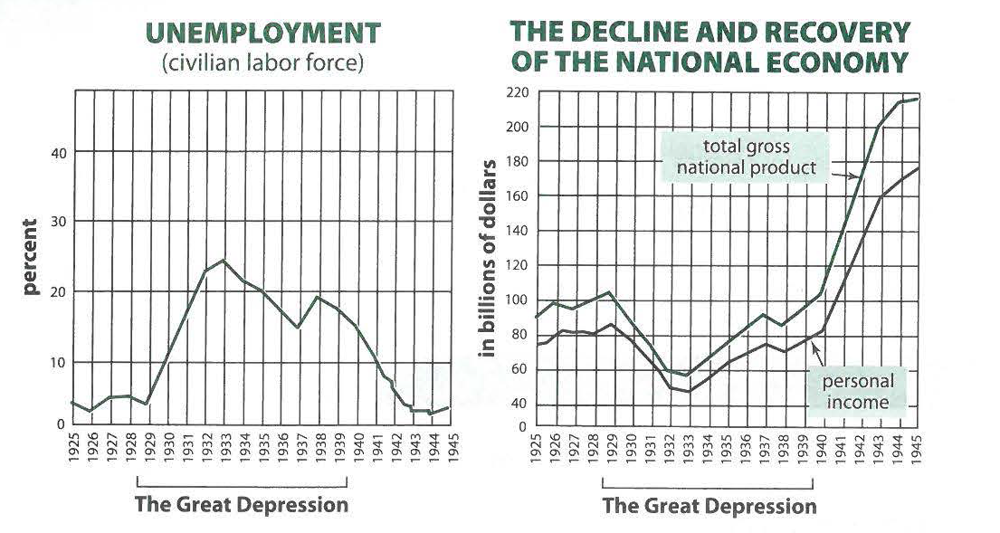

---
title: Skill Practice

source:
- title: Common Core Basics
  subject: Social Studies
  chapter: 2
  toc_type: Lesson Review
  toc_number: 2.4
  pages: 94 - 101

questions:
  - excerpt: 1, 2
    text: >
      
  - number: 1
    text: >
      What relationship do the graphs show between unemployment in 1933 and personal income that same year?
    choice:
      - option: A
        text: Unemployment was at a high, and so was personal income.
      - option: B
        text: Unemployment was low. and so was personal income.
      - option: C
        text: Unemployment was at its highest point in the same year that personal income was at its lowest point.
      - option: D
        text: There is no relat ionship between unemployment and personal income. 
    answer:
      - option: C
        text: >
          In 1933, unemployment was at its highest point and personal income was at its lowest point. As the number of unemployed people goes up, the average income per person goes down.
  - number: 2
    text: >
      What do the two graphs show about unemployment?
    choice:
      - option: A
        text: It increased from 1929 to 1933, and the gross national product declined.
      - option: B
        text: It decreased from 1929 to 1933, and the gross national product decreased in the same period.
      - option: C
        text: It declined continuously from 1933.
      - option: D
        text: Unemployment and the gross national product both increased in 1938.
    answer:
      - option: A
        text: >
          The first graph shows that unemployment rose from 1929 to 1933. The second graph shows the gross national product declining at that time.
  - excerpt: 3, 4
    text: >
      <blockquote>Women even more than men need the ballot to protect their special interests and their right to earn a living... We want a law that will prohibit home-work... We hear about the sacredness of the home. What sacredness is there about a home when it is turned into a factory, where we find a mother, very often with a child at her breast, running a sewing machine? Running up thirty-seven seams for a cent. Ironing and pressing shirts seventy cents a dozen, and children making artificial flowers for one cent... These women have had no chance to make laws that would protect themselves or their children.</blockquote>
      <blockquote>...[Men] discriminate against the class that has no voice. Some of the men say, 'You women do not need a ballot; we will take care of you.' We have no faith in man's protection... Give us the ballot, and we will protect ourselves.</blockquote>
      Excerpted from Up Hill with Banners Flying, by Inez Haynes Irwin
  - number: 3
    text: >
      What is the writer's opinion in this passage?
    choice:
      - option: A
        text: The ballot will not help the working woman.
      - option: B
        text: Men cannot be depended on to protect women and children.
      - option: C
        text: Men should protect the well-being of women and children.
      - option: D
        text: Giving women the right to vote will destroy the sanctity of the home.
    answer:
      - option: B
        text: >
          The speaker says "we have no faith in man's protection . . .. Give us the ballot, and we will protect ourselves."
  - number: 4
    text: >
      The law "that will prohibit home-work" specifically refers to putting an end to what?
    choice:
      - option: A
        text: work on one's home
      - option: B
        text: studying at home
      - option: C
        text: factory-like production at home
      - option: D
        text: sewing
    answer:
      - option: C
        text: >
          Women often worked from their homes, particularly sewing. They worked many hours and earned very little. It was an unfair business practice
        
layout: cc_review
---