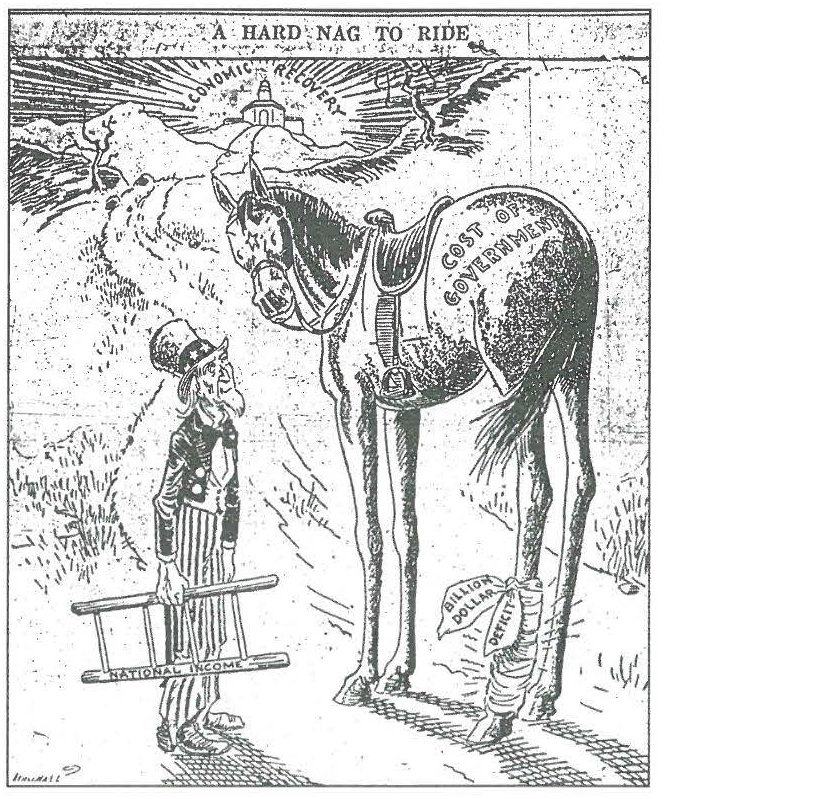

---
title: Skill Review

source:
- title: Common Core Basics
  subject: Social Studies
  chapter: 2
  toc_type: Lesson Review
  toc_number: 2.4
  pages: 94 - 101

questions:
  - excerpt: 1, 2, 3
    text: >
      A Hard Nag to Ride
      
  - number: 1
    text: >
      What word in the title gives a clue that this is t he Great Depression of the 1930s. not the recession of 2009? What might the cart oon look like if it was created today?
    choice: 
      - option: blank 
    answer:
      - text: >
          The word nag would probably not be used today to describe a horse. Today an artist might use a car, plane, or truck.
  - number: 2
    text: >
      What words in the labels help you to understand the topic?
    choice: 
      - option: blank 
    answer:
      - text: >
          The labels say economic recovery, cost of government, billion dollar deficit, and national income-which are all economic terms.
  - number: 3
    text: >
      Do you think the artist supports government spending to help restart the economy? How does the artist express this opinion in the cartoon?
    choice: 
      - option: blank 
    answer:
      - text: >
          The artist does not support government spending to restart the economy. He drew a very large horse that would be difficult to mount. The word billions is tied to the horse's leg as a little bandage.
        
layout: cc_review
---