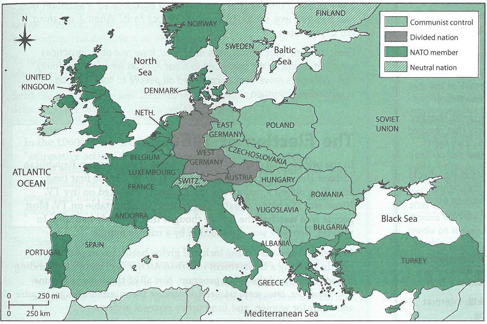

---
title: Skill Practice

source:
- title: Common Core Basics
  subject: Social Studies
  chapter: 3
  toc_type: Lesson Review
  toc_number: 3.1
  pages: 110 - 117

questions:
  - excerpt: 1, 2
    text: >
      Europe after World War II
      
  - number: 1
    text: >
      After World War II, the Soviet Union occupied part of Germany. Why would the Soviet Union want to keep control of this territory?
    choice:
      - option: A
        text: It wanted to show its might and power.
      - option: B
        text: The Soviet Union did not have sea or ocean access without this land.
      - option: C
        text: Stalin wanted the Soviet Union to join NATO.
      - option: D
        text: Stalin wanted a base from which he could spread communism into Europe.
    answer:
      - option: D
        text: >
          Stalin wanted to maintain control of all areas occupied by Soviet troops at the end of the war in order to spread communism.
  - number: 2
    text: >
      During the Cold War, the United States established military bases in Turkey. Why?
    choice:
      - option: A
        text: to position arms closer to the Soviet Union in order to contain communism
      - option: B
        text: to encourage trade with Asia
      - option: C
        text: to build an army
      - option: D
        text: to have access to the Black Sea
    answer:
      - option: A
        text: >
          The United States wanted places to put weapons during the arms race. It was trying to limit the spread of communism.
        
layout: cc_review
---