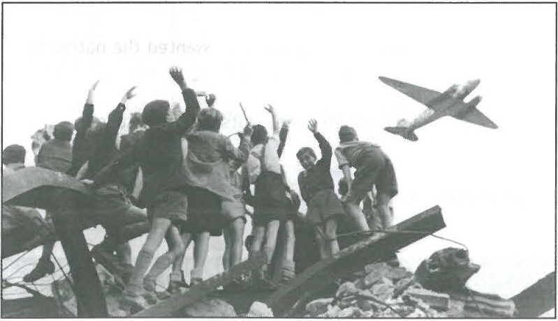

---
title: Skill Review

source:
- title: Common Core Basics
  subject: Social Studies
  chapter: 3
  toc_type: Lesson Review
  toc_number: 3.1
  pages: 110 - 117

questions:
  - excerpt: 1, 2, 3
    text: >
      In 1942 the US government instituted the Bracero program to bring farmers from Mexico to the Southwest. In Spanish, bracero means "farmer." Thousands of workers came to the United States to help harvest crops in t he Southwest. Braceros were considered temporary farm workers. They signed contracts written in English . These workers were often exploited, or taken advantage of.
        
      Jesus Campoya Calderon was one of these braceros. He describes his experience: "In the farms we would do anything, although our permit was to pick cotton only... I worked four months, seven days a week, at least 12 hours every day and I took home almost $300 dollars... Those were very good days..."
  - number: 1
    text: >
      What does Calder6n say about the type of work he did?
    choice:
      - option: blank 
    answer:
      - text: >
          Calderon says he and other workers did any work they were asked to do.
  - number: 2
    text: >
      What does this passage imply about the treatment of the braceros by their employers?
    choice:
      - option: blank 
    answer:
      - text: >
          The passage suggests that the braceros were not treated well by their employers. They had contracts (which they could not read), but the employers did not respect the contracts.
  - number: 3
    text: >
      What else does Calder6n say to support this implication?
    choice:
      - option: blank 
    answer:
      - text: >
          Calderon says he worked seven days a week, at least 12 hours every day. Those hours would not be part of a fair work agreement.
  - excerpt: 4, 5
    text: >
      During the Cold War, the Soviet Union blockaded ground supply routes to West Berlin, Germany. For ten months, supplies were airlifted into the city by the United States and Great Britain. Lt. Gail S. Halvorsen noticed children watching the planes come in. After talking with a group of these children, he began to drop tiny parachutes with candy and gum attached. Other pilots and crews soon begin dropping parachutes too. These pilots became known as the "Chocolate Flyers."
      
  - number: 4
    text: >
      Describe the setting and the impl ied mood of the people in the photograph.
    choice:
      - option: blank 
    answer:
      - text: >
          The photograph shows a group of excited children standing on top of a rubble heap.
  - number: 5
    text: >
      Do you think the photograph was effective in getting people to contribute money, candy. and gum for the airlifts? Why or why not?
    choice:
      - option: blank 
    answer:
      - text: >
          Sample answer: When people saw how excited the children were to receive the candy parachutes, they probably wanted to contribute to the project. A small gift was making many children happy.
          
        
layout: cc_review
---