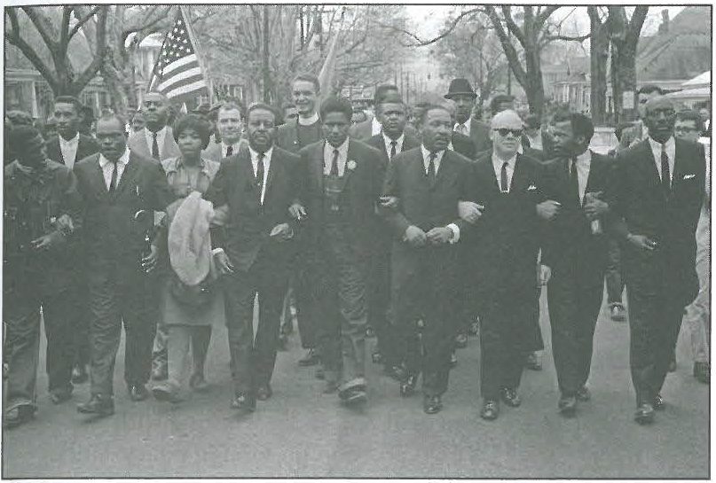

---
title: Skill Review

source:
- title: Common Core Basics
  subject: Social Studies
  chapter: 3
  toc_type: Lesson Review
  toc_number: 3.2
  pages: 118 - 123

questions:
  - excerpt: 1
    text: >
      Betty Friedan was an author and a leader of the modern women's rights movement. After graduating from Smith College in 1942, she became a writer and political activist. Her most famous book, The Feminine Mystique, was published in 1963. The book grew out of surveys that she had taken of her classmates from Smith. These surveys showed that despite their education and subsequent successes, the women were unhappy with their lives. The book became a best seller. In 1966, Friedan and other feminists formed the National Organization for Women (NOW). NOW worked to get women equal access to education and pay that was equal to the pay of men.
  - number: 1
    text: >
      List one cause-and-effect relationship in the passage about Betty Friedan?
    choice:
      - option: blank
    answer:
      - text: >
          Cause: Friedan surveys her Smith classmates. 
          Effect: Friedan wrote The Feminine Mystique.
  - excerpt: 2
    text: >
     
  - number: 2
    text: >
      Apply what you know about Martin Luther King Jr. and this time period to explain the importance of what is being shown in the photo.
    choice:
      - option: blank
    answer:
      - text: >
          Martin Luther King Jr. was a civil rights leader in the 1960s who believed in nonviolent protes ts. In this picture, he was taking part in a march. The protesters have linked arms to show their unity.
        
layout: cc_review
---