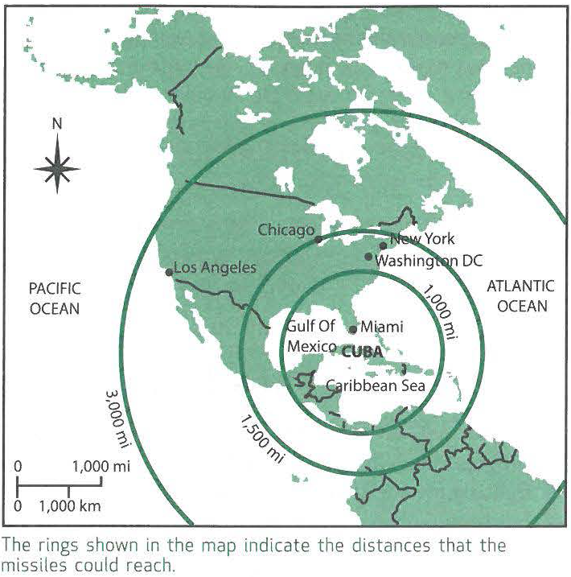

---
title: Skill Practice

source:
- title: Common Core Basics
  subject: Social Studies
  chapter: 3
  toc_type: Lesson Review
  toc_number: 3.3
  pages: 124 - 131

questions:
  - excerpt: 1, 2
    text:
      
  - number: 1
    text: >
      Many of the missiles installed in Cuba had a range of approximately 1,000 miles. If the missiles were launched from Cuba, which US city could they hit?
    choice:
      - option: A
        text: Los Angeles
      - option: B
        text: Chicago
      - option: C
        text: Washington. DC
      - option: D
        text: Miami
    answer:
      - option: D
        text: >
          Miami is the only city listed that is within the 1,000-mile range from Cuba.
  - number: 2
    text: >
      On the basis of the map and your knowledge of the cold war, which statement summarizes why the Soviet Union would be interested in building bases in Cuba?
    choice:
      - option: A
        text: The Soviet Union and Cuba were historic allies.
      - option: B
        text: Missiles launched from Cuba could hit the United States.
      - option: C
        text: Cuba could easily launch naval ships to target South America.
      - option: D
        text: The United States could not launch missiles in response to a Cuban threat.
    answer:
      - option: B
        text: >
          The Soviets could attack many US cities from Cuba. Cuba and the Soviet Union had not been allies for a long time. There is no evidence that the Soviets or Cubans wanted to attack South America. The United States could launch missiles at Cuba in the event of a threat.
        
layout: cc_review
---