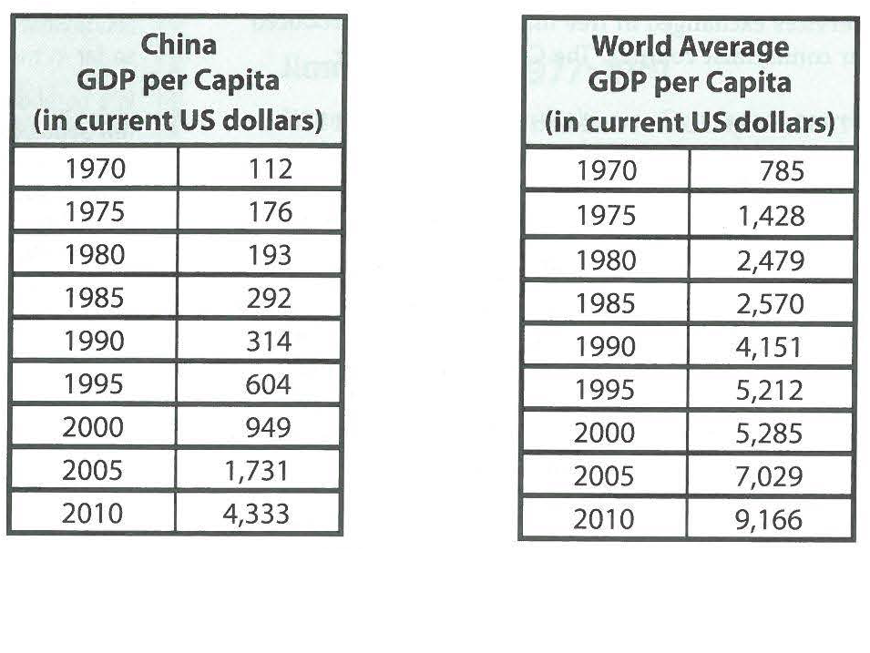

---
title: Skill Review

source:
- title: Common Core Basics
  subject: Social Studies
  chapter: 3
  toc_type: Lesson Review
  toc_number: 3.3
  pages: 124 - 131

questions:
  - excerpt: 1, 2, 3, 4, 5, 6
    text: >
      Study these charts related to gross domestic product (GDP) per capita. GDP per capita is the total value of all goods and services produced in a country in one year divided by the number of people in that country. Then answer the questions that follow.
      
  - number: 1
    text: >
      What was China's GDP per capita in 1970? How does it compare to the world average for 1970?
    choice:
      - blank 
    answer:
      - text: >
          $112 This was about one-seventh of the world average.
  - number: 2
    text: >
      Between 1980 and 1985, which GDP per capita increased more: China's or the world average? 
    choice:
      - blank 
    answer:
      - text: >
          China's GDP was increasing faster than the world average between 1980 and 1985.
  - number: 3
    text: >
      What was China's GDP per capita in 201O? How does it compare to the world average for 2010?
    choice:
      - blank 
    answer:
      - text: >
          $4,333 This was about one-half of the world average.
  - number: 4
    text: >
      What trend applies to both sets of data?
    choice:
      - blank 
    answer:
      - text: >
          Both GDPs are continually increasing. Both had a sharp increase between 2000 and 2005.
  - number: 5
    text: >
      How would you describe the trend that the data shows when you compare China's GDP per capita to the world average?
    choice:
      - blank 
    answer:
      - text: >
          China's GDP is increasing at a faster rate than the world average.
  - number: 6
    text: >
      What prediction can you make based on the trends you have identified?
    choice:
      - blank 
    answer:
      - text: >
          In a few years, China will match or beat the world average GDP.
        
layout: cc_review
---