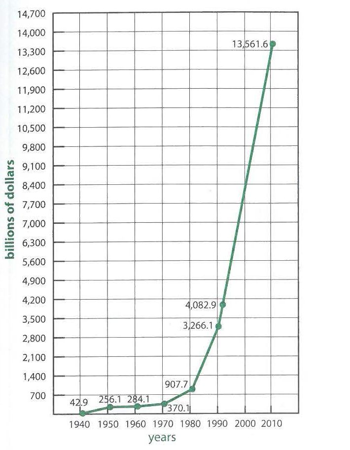

---
title: Skill Practice

source:
- title: Common Core Basics
  subject: Social Studies
  chapter: 3
  toc_type: Lesson Review
  toc_number: 3.4
  pages: 132 - 137

questions:
  - excerpt: 1, 2
    text: >
      US National Debt, 1940 - 2010
      
  - number: 1
    text: >
      During which 10-year period did the national debt show the largest dollar increase? 
    choice:
      - option: A
        text: 1940-1950
      - option: B
        text: 1960-1970
      - option: C
        text: 1970- 1980
      - option: D
        text: 1990-2000
    answer:
      - option: D
        text: Between 1990 and 2000, the national debt increased by more than $5,000 billion. This is greater than during any other 10-year period.
  - number: 2
    text: >
      What was the difference in the national debt between 1970 and 1960?
    choice:
      - option: A
        text: $538 billion
      - option: B
        text: $213 billion
      - option: C
        text: $86 billion
      - option: D
        text: $28 billion
    answer:
      - option: C
        text: >
          370.1 - 284.1 = 86
  - number: 3
    text: >
      Which statement provides a cause for President Nixon's impeachment?
    choice:
      - option: A
        text: He wanted to win the reelection.
      - option: B
        text: He ordered a cover-up of the Watergate break-in.
      - option: C
        text: He tampered with the voting process.
      - option: D
        text: He broke into the Democratic National Committee offices.
    answer:
      - option: B
        text: >
          Nixon ordered a cover-up of the break-in. Nixon himself was not a robber. He wanted to win re-election, but that was not the cause of his impeachment.
  - number: 4
    text: >
      Which was a cause of increased urbanization?
    choice:
      - option: A
        text: a decrease in air pollution
      - option: B
        text: an increase in suburban population
      - option: C
        text: a decrease in commuting times
      - option: D
        text: an increase in industrial jobs
    answer:
      - option: B
        text: >
          An increase in the population of the suburbs was one cause of increased urbanization.
        
layout: cc_review
---