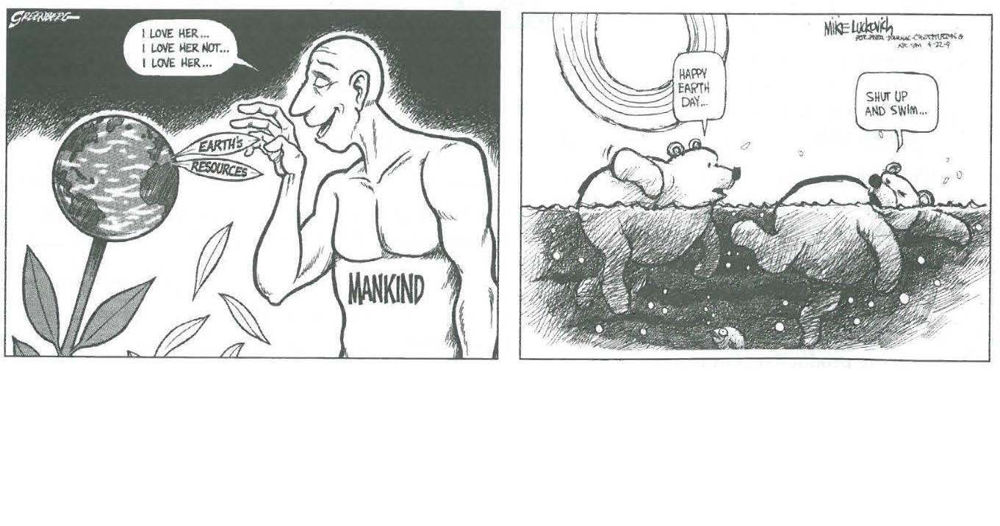

---
title: Skill Review

source:
- title: Common Core Basics
  subject: Social Studies
  chapter: 3
  toc_type: Lesson Review
  toc_number: 3.4
  pages: 132 - 137

questions:
  - excerpt: 1, 2
    text: >
      <blcokquote>The Nashua's pollution grew up with America. For more than a century, wood, wool, shoe, cotton, and paper mills had dumped waste into its quiet flow . . . . Because of dumped dyes, people used to bet on whether it was going to be red, orange, blue, green, or white the next day. Then a woman named Marion Stoddart started a campaign to restore the Nashua and its tributaries. It's been called a one-woman crusade, but in many ways it worked because it wasn't...</blcokquote>
      Michael Parfi.t, National Geographic, November 1993
  - number: 1
    text: >
      The passage does not tell you what the Nashua is. From context clues, what do you think the Nashua is?
    choice:
      - option: blank
    answer:
      - text: >
          The Nashua is a river.
  - number: 2
    text: >
      Which context clues helped you determine what the Nashua is?
    choice:
      - option: blank 
    answer:
      - text: >
          The waste was dumped into its "quiet flow." Stoddart was trying to restore it "and its tributaries." Mills were often placed beside rivers because rivers were a power source.
  - excerpt: 3
    text: >
      
  - number: 3
    text: >
      What comparisons and contrasts can you make about the two cartoons?
    choice:
      - option: blank
    answer:
      - text: >
          Both cartoons are about the environment. Both show that the environment is suffering. The first cartoon is about people quickly using up Earth's resources. The second cartoon is about the effect of global warming.
        
layout: cc_review
---