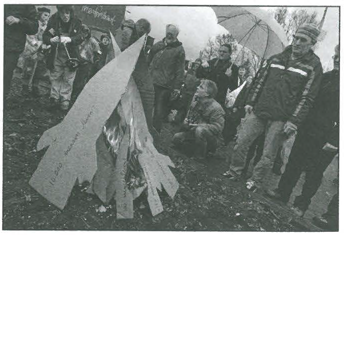

---
title: Skill Review

source:
- title: Common Core Basics
  subject: Social Studies
  chapter: 2
  toc_type: Lesson Review
  toc_number: 3.5
  pages: 138 - 143

questions:
  - excerpt: 1, 2
    text: >
      The idea that global warming is a fact is absurd! There is no reliable technology that can predict long-term climate change. Most weather technology can't even correctly predict tomorrow's weather. If the world's temperature is meant to rise, then what does human activity have to do with it? Even if there is an increase in climate temperature, there would not be much difference when the increase is spread out over hundreds of years. Meanwhile, attention and resources are being used to fight this "issue" when they should be fighting real issues like poverty and nuclear weapons.
  - number: 1
    text: >
      What is the author's opinion?
    choice:
      - option: blank
    answer:
      - text: >
          The author's opinion is that global warming is not the big problem that it is made out to be.
  - number: 2
    text: >
      Which words and phrases show the author's bias?
    choice:
      - option: blank 
    answer:
      - text: >
          The author says that global warming is "absurd" and that there are more important "real" issues for people to be concerned about.
  - excerpt: 3, 4
    text: >
      
  - number: 3
    text: >
      What do you think the photo shows?
    choice:
      - option: blank 
    answer:
      - text: >
          A group of people is protesting nuclear weapons by burning cardboard images of missiles.
  - number: 4
    text: >
      What can you interpret is the photographer's opinion may be about the issue portrayed in the photo?
    choice:
      - option: blank 
    answer:
      - text: >
          The photographer supports the protest. The message of the photo is that nuclear weaspons should be eliminated. The photo emphasizes that the people are protesting violence in a nonviolent way.
        
layout: cc_review
---