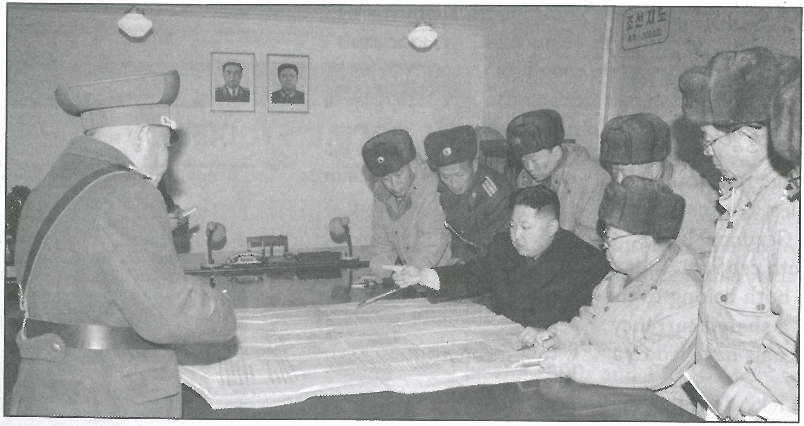

---
title: Skill Review

source:
- title: Common Core Basics
  subject: Social Studies
  chapter: 1
  toc_type: Lesson Review
  toc_number: 1.5
  pages: 44 - 47

questions:
  - excerpt: 1A - 1E
    text: >
      Use these terms to identify y the author's purpose for writing each of these articles: to inform, to entertain, to persuade.
  - number: 1A
    text: An editorial in a national newspaper
    choice:
      - option: to inform
      - option: to entertain
      - option: to persuade
    answer:
      - option: to persuade
        text: 
  - number: 1B
    text: A campaign ad for a person running for Congress
    choice:
      - option: to inform
      - option: to entertain
      - option: to persuade
    answer:
      - option: to persuade
        text: 
  - number: 1C
    text: A government brochure entitled "How to Vote"
    choice:
      - option: to inform
      - option: to entertain
      - option: to persuade
    answer:
      - option: to inform
        text: 
  - number: 1D
    text: A political cartoon
    choice:
      - option: to inform
      - option: to entertain
      - option: to persuade
    answer:
      - option: to entertain
        text: 
  - number: 1E
    text: A short-story in a magazine
    choice:
      - option: to inform
      - option: to entertain
      - option: to persuade
    answer:
      - option: to entertain
        text: 
  - excerpt: 2 - 5
    text: >
      Using the photograph and the information in this lesson, answer the following questions. 
  - number: 2
    text: Describe the people in the photo and tell what they are doing.
    choice:
      - option: blank
    answer:
      - option: 
        text: 
  - number: 3
    text: >
      What viewpoint do you think the photographer has of Kim Jong-un: positive, negative, or unbiased? Explain your answer.
    choice:
      - option: blank
    answer:
      - option: 
        text: 
  - number: 4
    text: When looking at this photo what opinion do you have of Kim Jong-un? Explain your answer.
    choice:
      - option: blank
    answer:
      - option: 
        text: 
  - number: 5
    text: What opinion do you think North Koreans would have of Kim Jong-un when they look at this photo? Explain your answer.
    choice:
      - option: blank
    answer:
      - option: 
        text: 
        
layout: cc_review
---