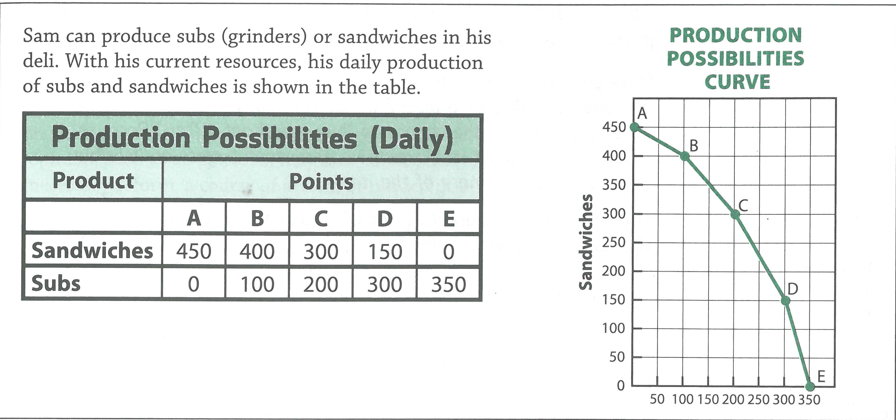

---
title: Skill Review

source:
- title: Common Core Basics
  subject: Social Studies
  chapter: 5
  toc_type: Lesson Review
  toc_number: 5.1
  pages: 184 - 189

questions:
  - excerpt: 1 
    text: >
      News about large businesses grabs most of the headlines. However, small businesses are an important part of the US economy. Generally speaking, a small business is a firm that employs fewer than 500 workers. In 2008, more than 99 percent of US businesses were small businesses. These small firms created about two-thirds of all new jobs. They also produced more than half of the country's output of nonfarm goods and services. Keeping small businesses healthy is important for US economic prosperity.
  - number: 1
    text: Find three supporting details in the passage. List the details in the space provided.      
    choice:
      - option: blank
    answer:
      - text: 
  - excerpt: 2, 3, 4, 5
    text: >
      
  - number: 2
    text: >
      How many sandwiches could Sam produce if all his resources are used to make sandwiches? On the PPC, which point shows this?
    choice:
      - option: blank
    answer:
      - text: 
  - number: 3
    text: >
      At point D. how many sandwiches could Sam's Deli produce? How many subs?
    choice:
      - option: blank
    answer:
      - text: 
  - number: 4
    text: >
      What is the opportunity cost at point B, stated in terms of sandwiches?
    choice:
      - option: blank
    answer:
      - text: 
  - number: 5
    text: >
      What is the opportunity cost at point C, stated in terms of subs?
    choice:
      - option: blank
    answer:
      - text: 
        
layout: cc_review
---