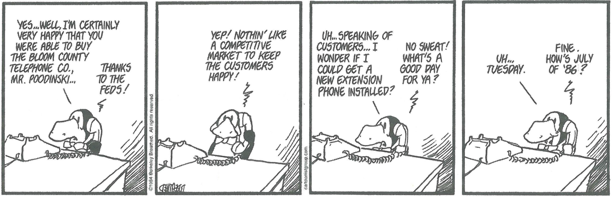

---
title: Skill Practice

source:
- title: Common Core Basics
  subject: Social Studies
  chapter: 5
  toc_type: Lesson Review
  toc_number: 5.5
  pages: 208 - 213

questions:
  - excerpt: 1, 2
    text: >
      
  - number: 1
    text: Which historical event does the cartoon refer to?
    choice:
      - option: blank
    answer:
      - text: 
  - number: 2
    text: What is the meaning of "competitive market" in the second frame of the comic?
    choice:
      - option: blank
    answer:
      - text: 
        
layout: cc_review
---